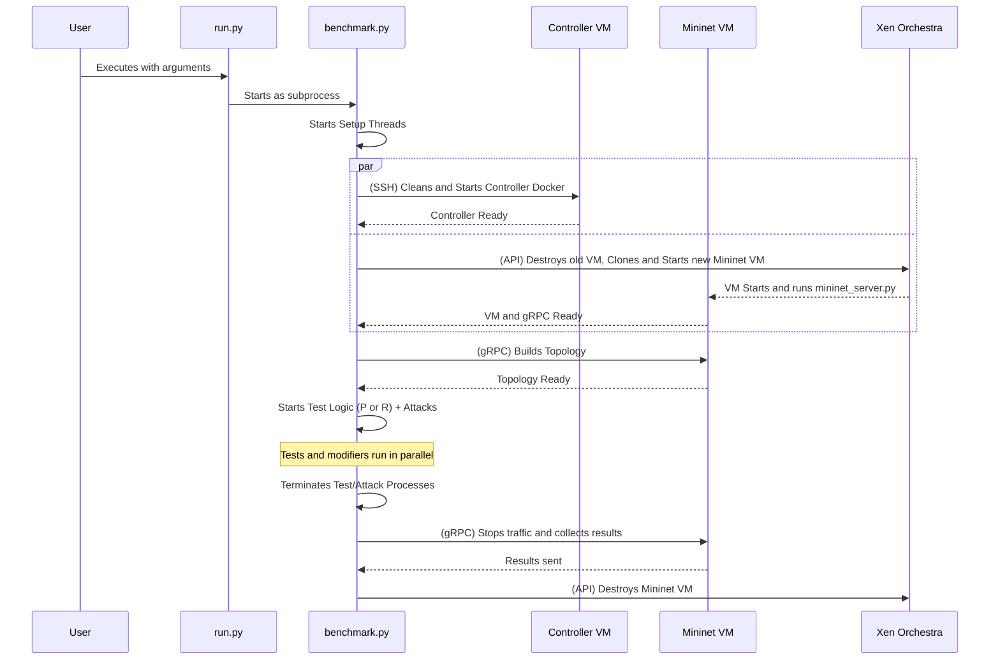
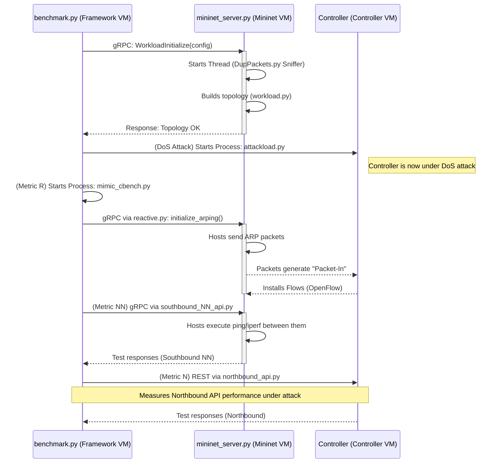

# SDN Testing Tool Execution Flow

This document describes the complete process executed by the framework, from the initial command to test completion and environment cleanup. The flow was designed to be fully automated, ensuring that each test is executed in an isolated and reproducible environment.

---

### Entry Point: `run.py`

The process begins with the execution of the `run.py` script. This file acts as a **high-level launcher**. Its main responsibility is to iterate over a pre-defined set of test configurations (controllers, topologies, metrics).

For each combination, it constructs and executes a command line for the main orchestrator, such as:
```bash
# Example call for Reactive mode with DoS attack
sudo python3 benchmark.py -n onos -t mesh -m R -dos
```
This command transfers control to the central orchestrator.

---

### The Central Orchestrator: `benchmark.py`

`benchmark.py` is the true brain of the framework. Once executed, it assumes full control of the test lifecycle. The process can be divided into three main phases.

### Phase 1: Environment Preparation (Parallel)

The orchestrator starts two threads running simultaneously to prepare the test environment as quickly as possible. A synchronization barrier (`threading.Barrier`) ensures that execution only proceeds when **both VMs (Controller and Mininet) are ready**.

1.  **Controller Configuration Thread:**
    *   Connects via SSH to the SDN Controller VM.
    *   Executes commands to stop and remove any existing SDN controller Docker containers, ensuring a clean environment.
    *   Starts a new Docker container with the specified controller for the test (e.g., `onosproject/onos`).
    *   Waits for the controller's REST API to become active, confirming it is ready.
    *   Reaches the barrier and waits for the other thread.

2.  **Mininet Configuration Thread:**
    *   Invokes the `xenorchestra.py` module to communicate with the **Xen Orchestra** API.
    *   **Destroys any VM** cloned from previous tests.
    *   **Clones a new VM** for Mininet from a pre-defined template, ensuring a clean network environment.
    *   Starts the newly created VM and waits for the gRPC server (`mininet_server.py`), which starts with the VM, to accept connections.
    *   Reaches the barrier and waits.

### Phase 2: Test Execution (General Logic)

With the environment ready, `benchmark.py` builds the network topology by sending a `WorkloadInitialize` command via **gRPC** to `mininet_server.py`. After network creation, the main test logic is executed based on the provided metric (`-m`).

*   **Proactive Mode (Metric `P`):**
    *   The goal is to test controller performance when forwarding rules already exist.
    *   The logic in `proactive.py` is called to proactively install flow rules (ARP, ICMP, L2) on all switches.
    *   Performance tests (`mimic_cbench.py`) or connectivity tests (`pingAll`) are executed **after** rules are installed.
    *   The `NNP` (Node-to-Node Proactive) sub-mode also installs rules but then measures latency and throughput between the most distant nodes in the topology.

*   **Reactive Mode (Metric `R`):**
    *   The goal is to measure the controller's responsiveness to new traffic.
    *   No flow rules are pre-installed.
    *   Measurement processes (`mimic_cbench.py`) and traffic generation (`reactive.initialize_arping`) are started immediately.
    *   ARP traffic forces the controller to discover hosts and install flow rules reactively. The measured performance reflects this overhead.
    *   The `NN` (Node-to-Node) sub-mode measures latency and throughput between the most distant nodes, which also depends on reactive flow installation.

*   **Modifiers (Attacks and Faults):**
    *   Arguments like `-dos`, `-slow`, or `-fault Rest` can be combined with `P` or `R` modes.
    *   When one of these arguments is detected, `benchmark.py` starts a **background process** (`attackload.py` or `faultload.py`).
    *   This attack/fault process runs simultaneously with the main test logic, allowing evaluation of controller performance under adverse conditions.

### Phase 3: Cleanup and Result Collection

After test completion, the orchestrator initiates the cleanup sequence:

1.  **Stop Processes:** Terminates any attack, fault, or measurement processes running in the background.
2.  **Result Collection:** Sends gRPC commands to the Mininet server to stop traffic generation and collect generated result files.
3.  **Network Deactivation:** Sends a `WorkloadTerminate` command via gRPC to shut down the Mininet topology.
4.  **Environment Destruction:** Invokes `xenorchestra.py` again to connect to Xen Orchestra and **destroy the Mininet VM** cloned for this test. This step is crucial to ensure total reproducibility and isolation of results.

---

### Simplified Flow Diagram



---

### Detailed Example Scenario: Reactive Mode with DoS Attack

Let's detail what happens in **Phase 2** for the command `benchmark.py ... -m R -dos`. This scenario is designed to evaluate the resilience and performance of the controller when forced to react to new traffic while under a Denial of Service attack.

1.  **Topology Construction and Sniffer Activation:**
    *   `benchmark.py` (orchestrator) sends the `WorkloadInitialize` gRPC command to `mininet_server.py`.
    *   On the Mininet VM, `mininet_server.py` receives the request and performs two important actions:
        1.  Starts a thread for the **OpenFlow packet sniffer** (`forward_openflow_packets` function in `DupPackets.py`), which will monitor communication between Mininet and the controller.
        2.  Calls `workload.py` to build the specified network topology (e.g., "mesh"), but without pre-installing flow rules.
    *   The server responds to the orchestrator confirming the network is created.

2.  **Attack Initiation:**
    *   On the Framework VM, `benchmark.py` detects the `-dos` argument.
    *   It starts a new background process executing the `run_xerxes` function within `attackload.py`. The DoS attack (Xerxes) on the controller's REST API begins and will continue running during the tests.

3.  **Reactive Test Initiation (Metrics R, NN, and N):**
    *   The orchestrator detects the `R` metric, which triggers the sequential execution of `R`, `NN`, and `N` tests.
    *   **Metric R (Southbound Reactive):** Starts a process for `mimic_cbench.py` to measure control plane performance and calls `reactive.initialize_arping`. This action forces the controller to install flow rules reactively.
    *   **Metric NN (Southbound Node-to-Node):** After the previous phase, `NN` logic is executed via the `initialize` function of `southbound_NN_api.py` to measure communication performance between the most distant nodes in the topology.
    *   **Metric N (Northbound API):** Finally, `N` logic is executed, calling the `initialize` function of `northbound_api.py` to measure response time and throughput of the controller's REST API (Northbound), which is still under attack.

4.  **Conclusion:**
    *   In the end, the performance measured in the three tests (`R`, `NN`, `N`) reflects the controller's ability to serve data, control, and management planes while being targeted by an attack. **Phase 3** (cleanup) proceeds as described in the general section.

#### Example Scenario Diagram

This diagram focuses on the details of **Phase 2** for this specific scenario.

