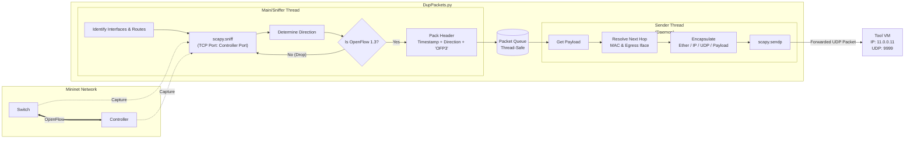

# DupPackets.py - OpenFlow Traffic Sniffer & Forwarder

## Overview
`DupPackets.py` is a critical component running inside the **Mininet VM**. Its primary purpose is to capture (sniff) the control plane traffic (OpenFlow) flowing between the Mininet switches and the SDN Controller, encapsulate it, and forward it to the **Tool VM** for real-time analysis or logging.

## Workflow

The script operates using a multi-threaded approach to ensure packet capture does not block packet forwarding.

1.  **Sniffing (Main Thread)**:
    *   Identifies the network interface communicating with the Controller.
    *   Captures TCP packets on the specific OpenFlow port using `scapy`.
    *   Determines traffic direction (Switch $\to$ Controller or Controller $\to$ Switch).
    *   Validates OpenFlow 1.3 messages (checking for protocol version `0x04`).
    *   Adds a custom header (Timestamp, Direction, Marker) and enqueues the payload.

2.  **Forwarding (Sender Thread)**:
    *   Monitors the thread-safe packet queue.
    *   Encapsulates the payload into a UDP packet.
    *   Forwards the packet to the Tool VM (Default IP: `11.0.0.11`, UDP Port: `9999`).

## Diagram

## Technical Details

*   **Protocol**: OpenFlow 1.3 (filters for version `0x04` in payload).
*   **Transport**: UDP Encapsulation.
*   **Custom Header Structure**:
    *   `Timestamp` (8 bytes, double)
    *   `Direction` (1 byte: `1` for Switch->Ctrl, `2` for Ctrl->Switch)
    *   `Marker` (4 bytes: `OFP3`)
*   **Dependencies**: `scapy`, `threading`, `queue`.